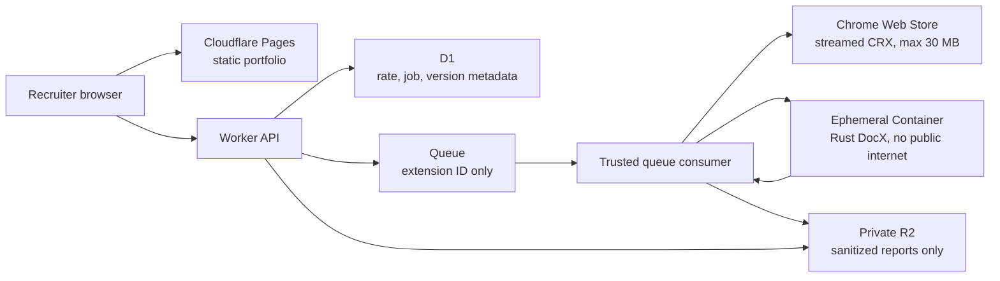

# Hosting stack decision for DocX Showcase

Research date: 2026-07-30

## Decision

Launch on **Cloudflare Pages + Workers + Queues + Containers + D1 + R2**, all in
one Cloudflare account on the Workers Paid plan.

This is the shortest credible path to the MVP because it:

- serves the indexable single-page portfolio from a static edge deployment;
- runs the existing Rust analyzer in a Linux container instead of requiring a
  WebAssembly port;
- has a documented switch that blocks public internet access from the analyzer
  container;
- scales the expensive worker to zero and gives the asynchronous queue a
  15-minute wall-time envelope;
- keeps rate-limit/job metadata and private, sanitized report objects on the
  same platform; and
- costs **US$5/month at the stated low-traffic workload**.

The recommendation is conditional on two launch gates:

1. a production-shaped benchmark must show that a 30 MB package completes
   within the proposed 5-minute/4 GiB/8 GB envelope; and
2. the service must fail closed after a global monthly allowance derived from
   that benchmark. Cloudflare budget alerts are informational and do not impose
   a provider-side hard stop, so application admission control is what keeps
   the modeled bill under US$10.

If either gate fails, use the Google Cloud alternative below. It has more setup
work, but its Cloud Run spend-cap preview can pause new Cloud Run usage after a
configured threshold.

## Requirements interpreted

- The main portfolio page is static, semantic, indexable, and friendly to
  search engines and AI crawlers.
- A visitor submits only a Chrome Web Store listing URL.
- An uncached extension version becomes an asynchronous job; a completed
  sanitized report is cached by extension ID and exact version and is never
  analyzed again.
- The downloaded CRX is limited to **30 MB = 30,000,000 bytes**. This is an
  application limit, not a provider limit.
- Extension content is untrusted. DocX never executes extension JavaScript.
  Analysis has bounded memory, CPU capacity, wall time, file count, extracted
  bytes, and ephemeral disk. Public internet access is disabled in the
  analyzer.
- Each IP may introduce at most three distinct uncached extension IDs in a
  rolling 60-minute window. Cached reports do not consume that allowance.
- Reports are private to the submitting browser session and are not exposed by
  stable public URLs.
- Sanitized reports persist indefinitely. CRX and extracted files disappear
  when the ephemeral analyzer is destroyed. Failed jobs expire after 24 hours.
- Target cost is US$0 when possible; the absolute operating target is below
  US$10/month.

## Cost-model assumptions

These are planning assumptions, not measured DocX results:

| Input | Low-traffic model | Cost-guard model |
| --- | ---: | ---: |
| New extension versions | 100/month | 400/billing cycle |
| Analyzer duration | 90 seconds average | 5 minutes maximum |
| Container | `standard-1`: 0.5 vCPU, 4 GiB RAM, 8 GB disk | same |
| Sanitized report size | 250 KB average | 2 MB maximum |
| Dynamic API traffic | 10,000 requests/month | below 10 million/month |
| Logs | under 100,000 events/month | sampled, no source or report payloads |

The 400-job ceiling is a capacity guard, not a product promise. When reached,
new uncached submissions should pause until the next billing cycle while
cached results remain available.

## Recommended architecture

### Request and job flow

1. Pages serves the portfolio and the precomputed FX Inline example. Static
   assets do not depend on a warm backend.
2. The Worker validates the listing URL, applies a separate abuse throttle, and
   writes an asynchronous job to Queues.
3. The queue consumer is trusted code. It streams the CRX from the Web Store,
   aborting as soon as either `Content-Length` or bytes observed exceeds
   30,000,000. It must not buffer the whole body in the Worker.
4. The consumer starts one `standard-1` Container with internet disabled and
   streams the package over the platform-internal request.
5. The container extracts only enough metadata to return the exact manifest
   version. The consumer atomically claims `(extension_id, version)` in D1.
   A completed or active claim returns/rejoins the existing job instead of
   running DocX again.
6. For a new version, the same ephemeral container analyzes the already staged
   package and returns only the Portfolio Report projection. The trusted
   consumer writes the report to a private R2 bucket and status/pointer data to
   D1.
7. The consumer explicitly destroys the container. No CRX, extracted file, raw
   report, source-map contents, or full source is retained.
8. The browser polls job status with an opaque, short-lived session capability.
   R2 is never public, and neither the API nor the report object has an
   indexable route.

Cloudflare documents a **100 MB request-body limit** for Free/Pro account plans,
so a streamed 30 MB package fits the platform envelope. Workers themselves have
**128 MB memory**, which is why streaming rather than buffering is a release
requirement. Paid Worker HTTP requests can use up to **5 minutes of CPU**;
Queue consumers have a **15-minute wall-time limit**.
[Workers limits](https://developers.cloudflare.com/workers/platform/limits/)

### Untrusted-input envelope

Start with these application-enforced limits and tune downward or upward only
from benchmark evidence:

| Resource | Launch setting | Enforcement |
| --- | ---: | --- |
| Compressed CRX | 30,000,000 bytes | trusted Worker streaming counter |
| Extracted bytes | 512 MiB | bounded extractor |
| Archive entries | 25,000 | bounded extractor |
| Largest extracted entry | 64 MiB | bounded extractor |
| Analyzer wall time | 5 minutes | process deadline plus queue cancellation |
| Analyzer container | 0.5 vCPU, 4 GiB, 8 GB ephemeral disk | `standard-1` instance |
| Concurrent analyzers | 1 at launch | serialized queue admission |
| Public network | disabled | `enableInternet = false` |

Cloudflare's `standard-1` type provides **0.5 vCPU, 4 GiB RAM, and 8 GB disk**.
The platform permits up to 4 vCPU, 12 GiB RAM, and 20 GB disk if later evidence
requires a larger tier.
[Container instance types and limits](https://developers.cloudflare.com/containers/platform-details/limits/)

Each container runs in its own VM, its disk is ephemeral, and cold starts are
typically **1–3 seconds**, dependent on image and entrypoint. Explicit `stop()`
or `destroy()` ends the instance; otherwise `sleepAfter` controls idle
shutdown.
[Container lifecycle](https://developers.cloudflare.com/containers/platform-details/architecture/)

`enableInternet = false` denies public internet access by default. Only
explicitly allowed hosts or trusted outbound handlers can leave the container;
non-HTTP traffic is denied except DNS to Cloudflare resolvers. For this MVP,
configure no allowed public hosts. The trusted Worker, outside the container,
performs the CRX fetch and storage operations.
[Container outbound controls](https://developers.cloudflare.com/containers/platform-details/outbound-traffic/)

The 512 MiB extraction cap and file-count limits are proposed DocX controls,
not Cloudflare limits. A compressed 30 MB archive can expand far beyond 30 MB;
the launch benchmark must include a compression bomb, excessive-entry archive,
oversized-entry archive, path traversal archive, malformed CRX, and a
representative 30 MB extension.

### Persistence and deduplication

- **D1** holds extension/version identity, job state, the object pointer,
  aggregate timing counters, rolling IP-rate records, and the monthly admission
  counter. Use an HMAC of the IP with a rotating secret; do not store raw IPs.
- **R2 Standard** holds only sanitized Portfolio Report JSON. Keep the bucket
  private. Object keys are derived opaque IDs, not guessable extension IDs.
- A unique database constraint on `(extension_id, version)` is the final
  deduplication guard. Queue delivery and retries must be idempotent.
- A report object is committed before the D1 row transitions to `complete`.
  Failure records expire after 24 hours; completed report rows and objects do
  not expire.

On Workers Paid, D1 includes **25 billion rows read/month, 50 million rows
written/month, and 5 GB storage** before overage pricing.
[D1 pricing](https://developers.cloudflare.com/d1/platform/pricing/)

R2 Standard includes **10 GB-month storage, 1 million Class A operations, and
10 million Class B operations per month**, with no internet egress fee.
[R2 pricing](https://developers.cloudflare.com/r2/pricing/)

Queues includes **1 million operations/month** on Workers Paid; a normally
delivered message is three operations (write, read, delete), and paid retention
is configurable up to **14 days**.
[Queues pricing](https://developers.cloudflare.com/queues/platform/pricing/)

These allowances are orders of magnitude above the stated low-traffic model.
The report cache reaches R2's 10 GB included storage at roughly 40,000 reports
if the 250 KB average assumption holds.

### Cost

Workers Paid has a **US$5/month minimum**. It includes 10 million Worker
requests and 30 million CPU-ms before request/CPU overages. Container usage
included in that plan is **25 GiB-hours RAM, 375 vCPU-minutes, and 200
GB-hours disk per month**. Overage rates are US$0.0000025/GiB-second,
US$0.000020/vCPU-second, and US$0.00000007/GB-second.
[Workers pricing](https://developers.cloudflare.com/workers/platform/pricing/)
[Containers pricing](https://developers.cloudflare.com/containers/pricing/)

At 100 scans × 90 seconds on `standard-1`, container use is:

- 10 GiB-hours RAM;
- 75 vCPU-minutes at full provisioned CPU; and
- 20 GB-hours disk.

All are within the US$5 plan's included amounts, so the modeled monthly total is
**US$5**.

At the fail-closed ceiling of 400 scans × 5 minutes, the conservative
provisioned-resource calculation is:

- 133.3 GiB-hours RAM, about **US$0.98** above the included amount;
- 1,000 vCPU-minutes, about **US$0.75** above the included amount; and
- 266.7 GB-hours disk, about **US$0.02** above the included amount.

That is about **US$6.75 total**, leaving roughly US$3.25 of the budget for D1,
R2, logs, retries, and rounding. The implementation should reserve at least 10%
extra container time for startup and cleanup and still stay below US$7 in this
model.

This is a modeled ceiling only if all creation paths pass through the same
atomic admission counter and every container has a forced deadline and
destruction path. Cloudflare budget alerts are evaluated from usage data and
are **informational only; they neither pause nor cap usage**.
[Cloudflare budget alerts](https://developers.cloudflare.com/billing/manage/budget-alerts/)

Required cost controls:

- admit no more than 400 new version analyses per billing cycle;
- one active analyzer at launch, with a queue dispatch rate of one;
- reject over-limit bodies before container start;
- set Worker CPU limits and container/application deadlines;
- explicitly destroy a container after success or failure;
- sample successful logs and never log CRX/report bodies;
- alerts at US$2 and US$4 of usage-based overage; and
- a manual kill switch that stops new uncached jobs while serving Pages and
  cached reports.

### Observability

Workers Logs includes **20 million events/month and seven-day retention** on
the paid plan. Emit structured events for accepted/rejected submissions, cache
hits, queue delay, download bytes/time, extraction counts/bytes, analyzer
wall/CPU time, outcome, container lifecycle, and estimated cost units. Never
emit raw IPs, source, snippets, source-map contents, or report payloads.
[Workers Logs pricing and limits](https://developers.cloudflare.com/workers/observability/logs/workers-logs/)

Cloudflare Pages allows **500 builds/month**, one concurrent build, and a
20-minute build timeout on Free; it supports up to 20,000 files and 25 MiB per
asset. That is ample for a single-page recruiter site and gives push-to-preview
deployments without keeping compute warm.
[Pages limits](https://developers.cloudflare.com/pages/platform/limits/)

## Alternatives compared

All three combinations can run the native Rust analyzer and satisfy the
functional MVP. Scores are relative to this project's constraints.

| Combination | Low-traffic cost | Isolation and 30 MB input | Cache/rate state | Cold start and delivery | Cost protection | Verdict |
| --- | ---: | --- | --- | --- | --- | --- |
| **Cloudflare Pages + Workers/Queues + Containers + D1/R2** | **US$5/month** | 4 GiB/8 GB container; per-VM isolation; documented `enableInternet=false`; streamed 30 MB fits 100 MB request limit | D1 metadata + private R2 report objects | Static page is independent; container cold start typically 1–3 s; one-platform deploy | app-level monthly gate; alerts do not cap | **Recommend: fastest and cleanest security fit** |
| **Firebase Hosting + Cloud Run/Tasks + Firestore/Cloud Storage** | **US$0/month** under free allowances; billing account required | Cloud Run second-generation microVM sandbox; configurable memory; network restriction requires Direct VPC egress/firewall design | Firestore metadata + private Cloud Storage objects | Static CDN; Cloud Run scales to zero; more IAM/VPC setup | Cloud Run spend-cap preview can pause Cloud Run, with reporting-latency overage; other services need quotas | Best fallback when provider-side compute cap matters more than delivery speed |
| **Cloudflare Pages + Fly Machines + SQLite volume** | About **US$2.36/month** under assumptions | Fly Machine hardware isolation; 2 GiB worker is ample candidate; analyzer-level no-network namespace must be built and proven | SQLite queue/cache on a 1 GB Fly Volume | Static page independent; pre-created worker starts on demand; custom orchestration and single-volume recovery | fixed number of Machines bounds compute, but Fly has no billing alerts/free tier | Viable and cheap, but highest operational burden |

### Alternative 1: Google-managed serverless

**Shape**

- Firebase Hosting for the static page.
- A small public Cloud Run API for admission and polling.
- Cloud Tasks invokes a private Cloud Run analyzer service at concurrency one.
- A trusted downloader service streams the CRX to private Cloud Storage.
- The analyzer uses Direct VPC egress with all traffic routed through the VPC,
  deny-all public egress, and Private Google Access only for required Google
  APIs.
- Firestore stores job/version/rate metadata; Cloud Storage stores temporary CRX
  and private sanitized report objects.
- Cloud Logging/Monitoring provides structured logs and system metrics.

Firebase Hosting includes **10 GB storage and 10 GB/month data transfer**;
individual files may be up to 2 GB.
[Firebase Hosting quotas](https://firebase.google.com/docs/hosting/usage-quotas-pricing)

Cloud Run request-based services include **180,000 vCPU-seconds, 360,000
GiB-seconds, and 2 million requests/month**. Cloud Run jobs and
instance-based services include 240,000 vCPU-seconds and 450,000 GiB-seconds.
[Cloud Run pricing](https://cloud.google.com/run/pricing)

Cloud Tasks includes the first **1 million operations/month** and supports a
maximum **30-minute** HTTP handler timeout. Task payloads are limited to
**1 MiB**, so queue only an object/job key, never the CRX.
[Cloud Tasks pricing](https://cloud.google.com/tasks/pricing)
[Cloud Tasks limits](https://docs.cloud.google.com/tasks/docs/quotas)
[HTTP task timeout](https://docs.cloud.google.com/tasks/docs/creating-http-target-tasks)

Firestore's free quota is **1 GiB stored, 50,000 reads/day, 20,000 writes/day,
20,000 deletes/day, and 10 GiB/month outbound**. TTL deletes are not part of
the free quota.
[Firestore quotas](https://firebase.google.com/docs/firestore/quotas)

Cloud Storage Always Free in `us-west1`, `us-central1`, and `us-east1` includes
**5 GB-month, 5,000 Class A operations, 50,000 Class B operations, and 100 GB
data transfer** to most destinations. Artifact Registry includes 0.5
GiB-month; storage above that is approximately US$0.10/GiB-month.
[Cloud Storage pricing](https://cloud.google.com/storage/pricing)
[Artifact Registry pricing](https://cloud.google.com/artifact-registry/pricing)

Cloud Logging includes the first **50 GiB/project/month** and 30 days of
retention.
[Google Cloud Observability pricing](https://cloud.google.com/products/observability/pricing)
[Cloud Logging retention](https://docs.cloud.google.com/logging/quotas)

At 100 × 90-second analyses with 1 vCPU/2 GiB, worker usage is 9,000
vCPU-seconds and 18,000 GiB-seconds, safely inside the free tier. The static
site, Tasks, Firestore, Storage, and logs also fit the cited free allowances
under the cost assumptions, making the modeled bill **US$0** (or about
US$0.05/month if a 1 GiB image leaves 0.5 GiB billable in Artifact Registry).

Cloud Run provides hardware-backed instance isolation; its second-generation
environment uses Linux microVMs plus seccomp and namespaces. Instances that
exceed their memory setting are terminated, and service memory can be
configured up to 32 GiB.
[Cloud Run security](https://docs.cloud.google.com/run/docs/securing/security)
[Cloud Run memory limits](https://docs.cloud.google.com/run/docs/configuring/services/memory-limits)

Direct VPC egress requires no connector and its network cost scales to zero.
Routing all traffic to a VPC lets firewall rules block public egress, while
Private Google Access retains access to Google APIs.
[Direct VPC egress](https://docs.cloud.google.com/run/docs/configuring/vpc-direct-vpc)
[Private Google Access](https://docs.cloud.google.com/vpc/docs/private-google-access)

The decisive disadvantages are delivery time and configuration risk: two
services, IAM, Cloud Storage lifecycle, VPC/firewall/DNS rules, and a billing
account must be provisioned and tested. The new Cloud Billing spend-cap feature
can pause Cloud Run at 100%, but it is Preview, applies only to eligible
services one project/service at a time, is not instantaneous, and in-flight
usage can add overage. A target below US$10 is therefore still required.
[Cloud Run spend-cap budgets](https://docs.cloud.google.com/billing/docs/how-to/budgets-spend-caps)

### Alternative 2: Fly Machines with a fixed machine count

**Shape**

- Cloudflare Pages Free for the static site.
- One always-on `shared-cpu-1x` 256 MB Fly API Machine.
- One pre-created `shared-cpu-1x` 2 GB analyzer Machine, stopped between jobs.
- A 1 GB Fly Volume with SQLite for rate-limit state, durable queue, version
  cache, and compressed sanitized reports.
- The API streams the CRX to the analyzer over Fly's private network; the
  analyzer runs DocX in a local no-network process namespace with cgroup and
  wall-time bounds, then posts the sanitized result back privately.

Fly's listed North America price is **US$2.02/month** for a continuously
running shared 1x/256 MB Machine and **US$11.11/month** for shared 1x/2 GB if
continuously running. Started Machines are billed per second; stopped Machines
are charged only for their root filesystem at US$0.15/GB-month. Volumes cost
US$0.15/GB-month; the first 10 GB of snapshot storage is included. A shared
IPv4 address and the first ten single-host certificates are included. North
America/Europe internet egress is US$0.02/GB.
[Fly resource pricing](https://fly.io/docs/about/pricing/)

Under the cost assumptions, the API is US$2.02, the 1 GB volume is US$0.15,
2.5 running hours of the 2 GB analyzer are about US$0.04, and an assumed 1 GB
stopped root filesystem is US$0.15: approximately **US$2.36/month** before
small egress. Fly Proxy can auto-start/stop existing Machines and never creates
new ones; the existing Machine count is therefore a natural compute bound.
[Fly autostop/autostart](https://fly.io/docs/launch/autostop-autostart/)

Fly Machines use hardware isolation, but Fly's platform controls do not supply
the same documented per-container `enableInternet=false` switch used by the
recommended stack. The nested analyzer process's no-network namespace is an
implementation responsibility and must be proven in production. Local SQLite
on one volume also creates a recovery/availability burden.
[Fly security overview](https://fly.io/docs/security/)

Fly includes managed Prometheus/Grafana metrics with about **15 days**
retention at no additional charge, but no built-in metrics alerting. Historical
logs are available for roughly **seven days**. Fly explicitly documents that
it has no free tier and does not support billing alerts.
[Fly metrics](https://fly.io/docs/monitoring/metrics/)
[Fly log access](https://fly.io/docs/monitoring/logs-api-options/)
[Fly cost management](https://fly.io/docs/about/cost-management/)

This stack is economically viable, but custom queue recovery, single-volume
backup/restore, process sandboxing, and manual alerting make it slower and
riskier to launch than Cloudflare.

## Why not a free Workers-only port?

A Workers-only build is not a credible fast path. Free Workers have 128 MB
memory and only 10 ms CPU per invocation; paid Worker code can use five minutes
of CPU but still has 128 MB memory. Porting the existing filesystem-oriented
Rust analyzer to WebAssembly and redesigning it around those limits would add
work and risk merely to avoid the US$5 container plan.
[Workers limits](https://developers.cloudflare.com/workers/platform/limits/)

## Launch blockers and explicit assumptions

### Blockers

1. **Benchmark the actual binary.** Measure container image size, cold start,
   peak RSS, ephemeral disk, CPU time, wall time, and sanitized report size on
   FX Inline plus representative 1 MB, 10 MB, and 30 MB fixtures. The
   `standard-1` recommendation is not final until these pass.
2. **Prove streaming.** Demonstrate that a 30,000,001-byte response is aborted
   without buffering or starting analysis, and that Worker peak memory stays
   safely below 128 MB.
3. **Prove egress denial.** From the running analyzer container, attempts to
   reach an arbitrary HTTPS host and non-HTTP endpoint must fail while the
   trusted Worker can still fetch the CRX and persist the sanitized output.
4. **Prove idempotency under races.** Concurrent submissions and Queue retries
   for the same extension version must create one analysis and one report.
5. **Prove hostile-archive bounds.** Compression bombs, traversal paths,
   symlinks, malformed headers, excessive entries, and timeouts must destroy
   the container without retaining input.
6. **Confirm Chrome Web Store acquisition.** Package download legality,
   stable URL discovery, redirects, headers, and version extraction are a
   separate Wayfinder decision and can invalidate the fetch design.
7. **Confirm billing-cycle gate behavior.** The D1 admission counter must reset
   on the same account billing boundary used for container allowances, and all
   container start paths must require a successful admission lease.

### Assumptions

- DocX builds and runs on `linux/amd64`.
- A `standard-1` container is available to the account and region placement is
  acceptable.
- A typical analysis averages 90 seconds and a worst-case accepted analysis
  can be terminated at five minutes without corrupting shared state.
- A 512 MiB extracted-size limit and 25,000-entry limit admit the recruiter
  examples worth supporting. This must be tested, not guessed at launch.
- Sanitized reports average 250 KB and never exceed 2 MB.
- Traffic stays far below 10 million dynamic requests and 20 million log
  events/month.
- The public Pages site can remain functional when uncached scanning is paused.
- Taxes and currency conversion are outside the US-dollar service-price model.

## Acceptance checks for implementation

- A fresh uncached version returns a job immediately and completes
  asynchronously.
- Repeating the exact version, including concurrently, does not execute DocX a
  second time.
- Cached report viewing does not consume the per-IP three-extension allowance.
- A fourth distinct uncached extension from the same IP hash within a rolling
  60-minute window is rejected.
- The CRX stream aborts above exactly 30,000,000 bytes.
- All hostile-input limits terminate predictably with no retained CRX.
- Analyzer public egress tests fail.
- R2 objects and report API routes cannot be fetched without the current
  session capability and return `X-Robots-Tag: noindex, nofollow`.
- The main static page, sitemap, and robots policy remain crawlable.
- At 100 measured scans, the cost projection remains at US$5; at the configured
  monthly maximum, the conservative projection remains below US$10.
- Structured dashboards show cache-hit ratio, job latency, analysis time,
  failures, queue age, resource usage, and estimated billable units without
  leaking extension source or visitor IPs.
